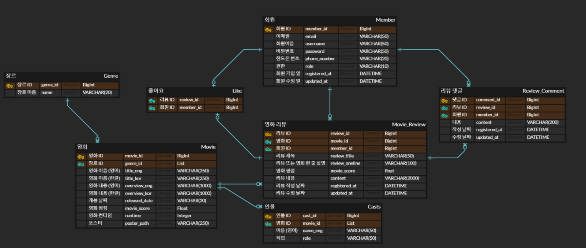
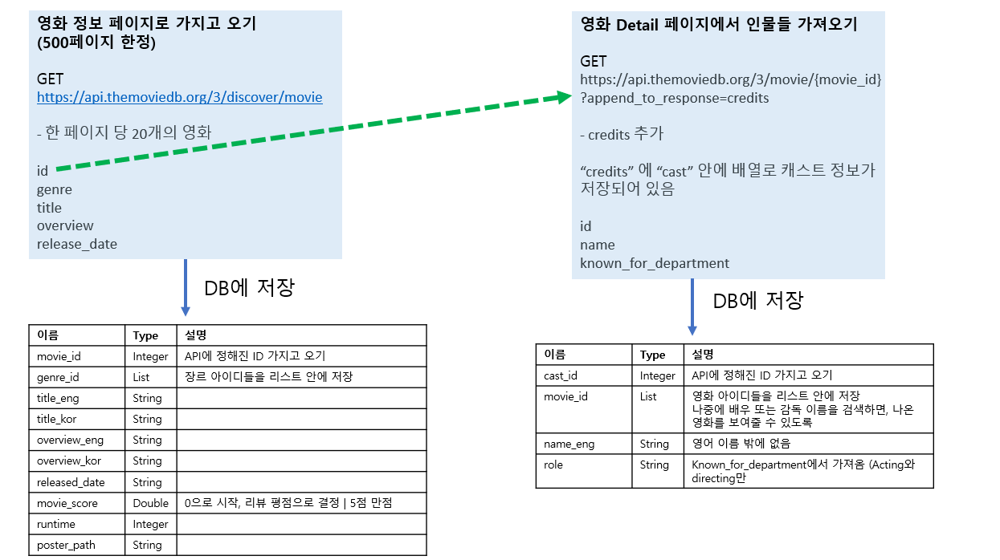

# 영화 리뷰 (MOVMAG)

[개발 진행 계획](https://www.notion.so/b57220fd5c6446239bdb9c5eb7296a30?pvs=4)

## What?

> #### 🪄영화에 대한 리뷰만 읽는 것이 아닌, 영화에 대해 소통할 수 있는 어플리케이션 개발이 목표

#### 영화 매거진에서 컨셉을 정해보았다

- 영화에 대한 리뷰, 그리고 리뷰에 대한 댓글을 달 수 있다
- 영화에 대한 리뷰만 읽는 것이 아닌, 영화에 대해 소통할 수 있는 어플리케이션 개발이 목표

#### 심화. 영화로 시작하지만, 가능하다면 TV 쇼도 추가할 예정이다

## Who?

#### 이용자는 크게 두 분류로 나뉜다

- 리뷰를 작성하는 **EDITOR**
  - 리뷰를 쓰고, 읽고, 수정하고, 삭제할 수 있음
  - 댓글을 쓰고, 읽고, 수정하고, 삭제할 수 있음
- 리뷰를 읽는 일반 **USER**
  - 리뷰를 읽을 수 있음
  - 댓글을 쓰고, 읽고, 수정하고, 삭제할 수 있음

## How?

#### 영화에 관련된 정보는 TMDB에서 영화 API를 사용할 예정

- 미리 영화들을 DB에 저장을 할 예정 (DB는 MySQL)

## User Flow

## Software Architecture C4 Model (Level 3)

## 사용 기술

- Java 8 (JDK 1.8)
- Gradle
- Spring Boot : 2.7.16
- MySQL
- Spring Security
- Swagger
- ElasticSearch

## ERD

- Movie 테이블의 poster_path 같은 경우
  - `https://image.tmdb.org/t/p/original/[poster_path]` 를 사용하면 이미지를 가지고 올 수 있다
- TMDB API 있는 모든 영화와 인물을 가져오지 못 할 것 같다
  - 모든 영화 리스트와 인물에서 500페이지, 약 10000개 이하의 데이터까지만 가져오게 되어 있었다 (그 외에는 유로인 것 같음)
  - 영화 리스트 + now playing 영화를 토대로 저장 할 예정

## 구현할 기능

#### 인증 (모두)

- **POST 회원가입**
  - 회원가입을 할 때에 EDITOR 또는 USER 권한을 정한다
- **POST 로그인**
  - 해당 어플리케이션은 로그인을 리뷰를 볼 수 있다

#### 영화

- **TMDB에 저장되어 있는 영화를 업데이트 하기** (ADMIN만 할 수 있음)
  - 처음에는 모든 영화를 DB에 저장하기
    - 811188개
  
  - 이후에 업데이트 할 때에는 Now Playing만 업데이트 하기
    - 2023-09-06 ~ 2023-10-24 : 2173개
  
  - 스케줄러 사용 (Overwrite)
  
- **GET 영화 목록 검색** (ADMIN, EDITOR, USER) - 리뷰 작성할 때 필요
  - ***Elastic Search 사용***
  - 영화 제목 (한글 가능)
  - 영화 감독 (영어만)
  - 영화 배우 (영어만)

#### 영화 리뷰

- **POST 작성** (EDITOR)
  - 리뷰 제목 / 영화 이름 / 영화 점수(Editor가 주는 점수) / 리뷰 내용
- **GET 키워드 검색** (ADMIN, EDITOR, USER)
  - ***Elastic Search 사용***
  - 리뷰 제목
  - 리뷰를 쓴 유저
  - 영화
- **GET 리뷰 상세 내용** (ADMIN, EDITOR, USER)
- **PUT 리뷰 수정** (EDITOR)
- **DELETE 리뷰 삭제** (ADMIN, EDITOR)
  - ADMIN은 비적정한 리뷰를 삭제할 수 있다
- **GET 리뷰 좋아요** (EDITOR, USER)
- **GET 인기 리뷰** (EDITOR, USER)
  - 리뷰 좋아요를 토대로, 탑 10 리뷰 목록 보여주기

#### 리뷰 댓글

- **POST 작성** (ADMIN, EDITOR, USER)
- **GET 해당 리뷰에 대한 댓글 일기** (ADMIN, EDITOR, USER)
  - 시간 순으로 내림차순으로 (최신이 제일 위에)
- **PUT 댓글 수정** (ADMIN, EDITOR, USER)
- **DELETE 리뷰 댓글 삭제** (ADMIN, EDITOR, USER)
